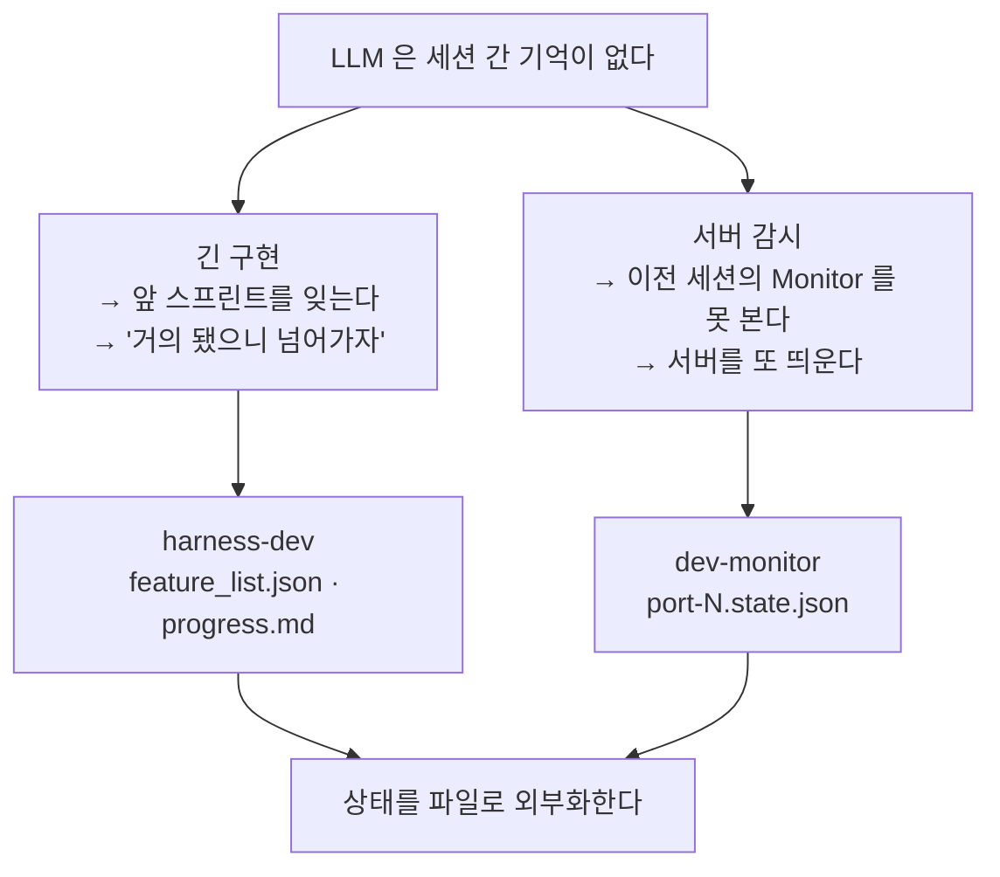
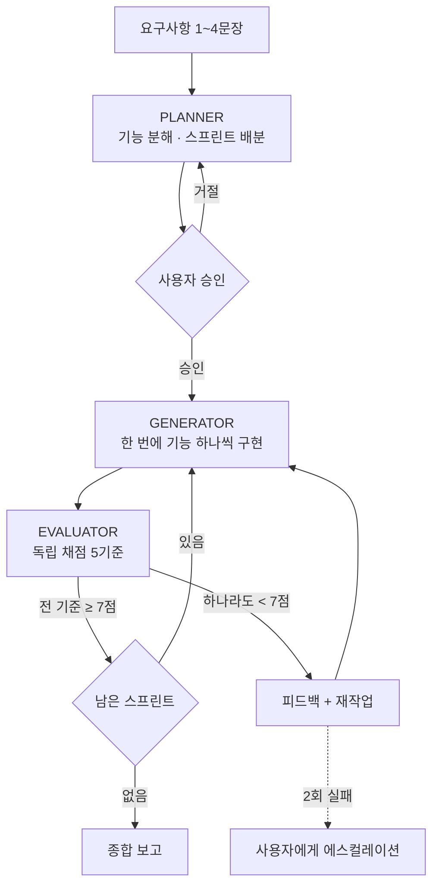
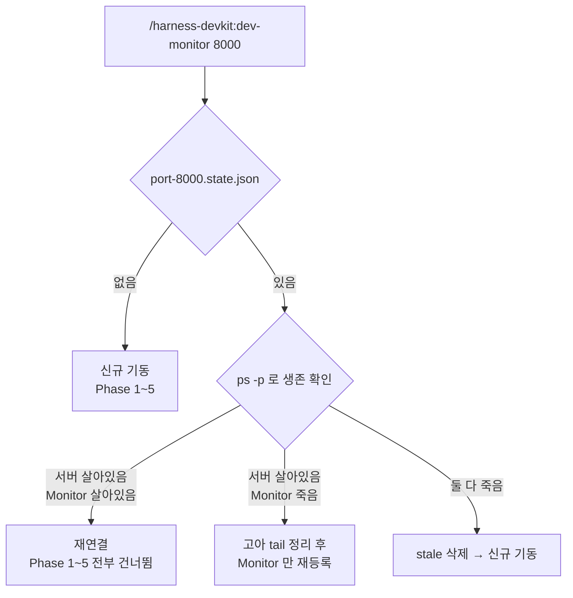

# harness-devkit 사용 가이드

> **대상** — 에이전트에게 큰 구현을 맡겼다가 "다 됐습니다"라는 말을 믿었다 낭패를 본 개발자
> **범위** — 스킬 2개(`harness-dev`, `dev-monitor`), 훅 1개, 스크립트 2개
> **읽는 순서** — 1절이 *왜 두 스킬이 한 플러그인인지*, 2~4절이 `harness-dev`,
> 5~6절이 `dev-monitor`, 7~9절이 *언제 쓰고 언제 피하나*

## 선행 요건과 설치

| 요건 | 쓰는 곳 | 없으면 |
|---|---|---|
| 프로젝트 `CLAUDE.md` | `dev-monitor` | **즉시 중단**한다. 서버 명령을 추측하지 않는다 |
| context7 MCP | `dev-monitor` | 오류 분석이 근거 없는 추측으로 떨어진다 |
| WebSearch | `dev-monitor` | 외부 이벤트(CVE·장애·차단 정책)를 못 짚는다 |
| `lsof` · `pkill` | `dev-monitor` | 포트 정리와 Monitor 종료가 안 된다 (macOS·Linux 기본 포함) |

`harness-dev` 는 필수 선행 요건이 없다. 다만 Evaluator 는 **가능하면 실제로 실행해서** 검증하므로
(HTML 은 브라우저 렌더링, 파이썬은 실행, RN 은 빌드·lint) 그 수단이 없으면 코드 리뷰 기반으로
떨어지고, 스킬이 그 한계를 명시하게 되어 있다.

```
/plugin marketplace add https://github.com/kbk109-dev/kbk109-plugins-marketplace
/plugin install harness-devkit@kbk109-plugins-marketplace
```

---

## 1. 무슨 문제를 푸는가

두 스킬은 하는 일이 전혀 다르다. 하나는 앱을 짓고 하나는 서버 로그를 본다.
**그런데 둘 다 같은 실패를 막는다 — 에이전트가 자기가 어디까지 했는지 잃어버리는 것.**



증상은 다르지만 처방이 같아서 한 플러그인이다.

**두 실패의 결정적 공통점은 조용하다는 것이다.** 스프린트를 건너뛰어도 에러가 안 나고,
서버가 두 벌 떠도 포트는 하나만 잡히니 겉보기엔 정상이다. 이 플러그인이 하는 일은
**조용한 실패를 시끄러운 실패로 바꾸는 것**이다.

> 배경 이론은 [`docs/harness-engineering/`](../harness-engineering/) 에 있다.
> 이 가이드는 그 이론이 두 스킬에서 어떤 모습으로 나타나는지만 다룬다.

---

## 2. harness-dev — 3-에이전트로 무엇이 달라지나

한두 문장짜리 요구사항("할 일 관리 앱 만들어줘")을 받아 **역할이 다른 세 에이전트**로 나눠 짓는다.



핵심은 화살표가 아니라 **누가 판정하느냐**다.

| 나누는 것 | 왜 |
|---|---|
| Planner ≠ Generator | 계획한 사람이 구현하면 계획을 자기 편의대로 줄인다 |
| **Generator ≠ Evaluator** | **구현한 사람이 채점하면 반드시 후하다.** 이게 이 스킬의 존재 이유다 |
| 기능 하나 = 작업 단위 | 여러 개를 동시에 잡으면 "대충 다 된 것 같다"가 성립해 버린다 |

Generator 의 자체 평가는 **참고만** 한다. Evaluator 의 판정이 최종이다.

### `status: "fail"` 이 기본값이다

가장 작지만 가장 큰 장치다. 새 기능은 전부 `"fail"` 로 태어나고 `"pending"` 은 **존재하지 않는다.**

```
"pending" 이 있으면  →  "아직 안 한 것"과 "해봤는데 안 되는 것"이 섞인다
                      →  마지막에 pending 을 훑으며 "이건 됐지" 하고 넘긴다
"fail" 만 있으면     →  통과를 증명하지 못한 모든 것은 실패다
```

에이전트는 **통과를 증명해야** `"pass"` 를 얻는다. 증명 없이 지나가는 경로가 문법적으로 없다.

---

## 3. 실행하면 무슨 일이 일어나나

### 멈춰 서서 물어보는 지점

`dev-monitor` 와 달리 `harness-dev` 는 **묻는 지점이 적다.** 한 번은 항상 묻고, 나머지는 사고가
났을 때만 묻는다.

| # | 멈추는 지점 | 무엇을 묻나 | 언제 |
|---|---|---|---|
| 1 | Planner 완료 후 | 기능 목록과 스프린트 계획대로 갈지 | **항상** |
| 2 | 같은 스프린트 2회 실패 | 반복 실패를 어떻게 처리할지 | 사고 시 |
| 3 | 접근 2회 전환 후 실패 | 루프에서 못 빠져나올 때 | 사고 시 |

1번 전까지는 코드가 하나도 안 생긴다. 계획을 보고 되돌릴 수 있다.

**Phase 0 은 묻지 않고 스스로 빠진다.** 기능이 3개 이하로 판단되면 이 스킬을 쓰지 않고 일반
개발로 전환한다 — 버그 하나 고치는 데 스프린트와 채점을 돌리는 건 순수한 낭비다.

### 8가지 기계적 제약 — 무엇을 막는지

SKILL.md 에 "어떤 상황에서도 재정의할 수 없다"고 못 박힌 규칙들이다. 각각이 **특정한 지름길**을
막는다. 지름길 쪽을 읽어야 왜 필요한지 보인다.

| 제약 | 이게 없으면 생기는 지름길 |
|---|---|
| 한 번에 하나의 기능 | 여러 개를 열어 놓고 "전체적으로 거의 됨"으로 뭉갠다 |
| **테스트 삭제 금지** | **어려운 `acceptance_criteria` 를 쉽게 고쳐서 통과시킨다** |
| 자기 평가 불신 | Generator 가 자기 작업에 후한 점수를 준다 |
| 스텁 금지 | `TODO` 와 `mock` 으로 "겉으로만 완성"된 프로젝트가 나온다 |
| 진행 기록 필수 | 다음 세션이 처음부터 다시 헤맨다 |
| JSON 형식 유지 | Markdown 으로 바꾸면 상태가 산문이 되어 기계 판독이 깨진다 |
| 재시도 상한 2회 | 같은 실패를 무한히 반복하며 토큰만 태운다 |
| `status` 기본값 `fail` | 증명 없이 통과하는 경로가 생긴다 |

두 번째가 가장 위험하다. **합격 기준을 고칠 수 있으면 나머지 일곱 개가 전부 무의미해진다.**

---

## 4. 산출물 — `docs/harness/{slug}/`

Planner 가 요구사항에서 slug 를 뽑아 프로젝트 전용 폴더를 만든다.

```
<내-프로젝트>/
├── docs/harness/
│   └── todo-manager/              ← slug. 이미 있으면 todo-manager-2
│       ├── feature_list.json      ← 기능 · acceptance_criteria · status
│       ├── project_spec.md        ← 제품 사양 · 기술 스택 · 제약
│       ├── progress.md            ← 세션 간 인수인계 로그
│       └── sprint_reports/
│           ├── sprint_01_eval.md  ← Evaluator 채점 근거
│           └── sprint_02_eval.md
└── src/                           ← 실제 구현
```

`feature_list.json` + `progress.md` 두 개면 **30초 안에** 프로젝트 상태가 복원된다는 것이 설계
목표다. 새 세션의 Generator 는 이 둘부터 읽고, 현재 스프린트의 목표를 **명시적으로 다시 선언**한
뒤 작업을 시작한다(목표 표류 방지).

### `docs/harness/` 는 여러 스킬이 나눠 쓰는 이름공간이다

실제 프로젝트를 열어 보면 이렇게 섞여 있다. **`docs/harness/` 아래 있다고 전부 `harness-dev` 가
만든 것이 아니다.**

```
docs/harness/
├── todo-manager/                  ← harness-dev  ({slug}/ 아래로 격리)
└── firebase/
    ├── analytics/                 ← firebase-analytics-impl
    │   ├── ga-feature-list.json
    │   └── ga-progress.txt
    └── crashlytics/               ← firebase-crashlytics-impl
        ├── CRASHLYTICS_FEATURES.json
        └── CRASHLYTICS_PROGRESS.txt
```

`{slug}/` 격리는 이 충돌을 막으려고 들어간 것이다. **`docs/harness/` 바로 아래에 `progress.md`
와 `sprint_reports/` 가 평평하게 놓여 있다면 slug 격리 이전 버전이 만든 산출물이다** — 다른
프로젝트를 같은 폴더에 또 돌리면 덮어쓴다.

---

## 5. dev-monitor — 왜 상태를 파일로 빼는가

서버를 띄우고 로그를 감시한다. 어려운 부분은 감시가 아니라 **"이미 띄웠는지"를 아는 것**이다.



`TaskList` 를 보면 안 된다. **`TaskList` 는 현재 세션만 비추는 휘발성 메모리**라서, 이전 세션이
띄운 서버가 "없는 것"으로 보인다. 그 상태로 진행하면 서버가 두 벌 뜬다. 상태 파일이 Ground Truth 다.

### 서버와 Monitor 는 수명이 다르다 (1.1.0)

이 스킬에서 가장 헷갈리는 지점이고, 1.1.0 에서 고쳐진 부분이다.

| | 정체 | 세션이 끝나면 |
|---|---|---|
| `server_pid` | `nohup` 으로 띄운 진짜 PID | **살아남는다** |
| `monitor_pid` | Monitor 래퍼 셸의 진짜 PID | **죽는다** |
| `monitor_task_id` | `Monitor` 도구의 task ID (문자열) | 무효가 된다 |

그래서 새 세션에서 **"서버는 살아 있는데 Monitor 는 죽어 있다"는 정상**이다. 사고가 아니다.
서버만 재사용하고 Monitor 는 다시 등록하는 것이 옳은 처리다.

`monitor_pid` 를 확보하는 방법이 조금 특이하다. `Monitor` 도구는 PID 가 아니라 task ID 를
돌려주므로 그 값으로는 `ps -p` 도 `kill` 도 안 된다. 그래서 명령 첫 줄에 `echo $$` 를 넣어
래퍼 셸의 진짜 PID 를 파일로 남긴다.

```bash
echo $$ > ~/.claude/dev-monitor/port-8000.monitor.pid
tail -f /tmp/dev_server_8000.log | grep --line-buffered -E "..."
```

> **1.1.0 이전 상태 파일은 자동으로 stale 처리된다.** 예전 버전은 `monitor_pid` 자리에 task ID
> 문자열(`"b1cgaqjgm"`)을 넣었다. 값이 숫자가 아니면 구스키마로 보고 생존 판정과 `kill` 을
> 건너뛴다. 그냥 다시 실행하면 되고, 손으로 지울 필요는 없다.

---

## 6. dev-monitor 실행 흐름과 하드 게이트 2개

| Phase | 하는 일 |
|---|---|
| 0 | 포트 검증. `stop`·`stop-all`·`status` 는 여기서 선분기 |
| 0.5 | **상태 파일 확인** — 재진입 감지 |
| 1 | `CLAUDE.md` 에서 서버 명령 추출 |
| 2 | 포트 정리 (`lsof` → 서버 프로세스만 kill) |
| 3 | `docker compose ps` (compose 파일 있을 때만) |
| 4 | `nohup` 백그라운드 기동 + health 확인 + **상태 파일 기록** |
| 5 | Monitor 등록 (`echo $$` → pidfile → 상태 파일 갱신) |
| 6 | 이상 감지 시 `[날짜 시간]` + 원인 + 해결 방향 표 |
| 7 | heartbeat / `status` 보고 |
| 8 | 종료 — `TaskStop` → `pkill -P` → `kill` → 고아 청소 |

### 게이트 2개는 물어보지 않고 **중단**한다

| 게이트 | 조건 | 왜 묻지 않고 멈추나 |
|---|---|---|
| Phase 0 | 포트 미입력 | 기본 포트를 가정하면 엉뚱한 포트의 남의 프로세스를 kill 한다 |
| Phase 1 | `CLAUDE.md` 없음 / 명령 못 찾음 | **틀린 명령으로 서버를 띄우는 것보다 멈추는 게 낫다** |

두 번째가 이 스킬의 성격을 정한다. 서버 명령의 단일 소스는 `CLAUDE.md` 이고, 모델이 스스로
`npm run dev` 를 추론해 실행하는 경로는 **없다.** 탐색 순서는 `./CLAUDE.md` →
`./.claude/CLAUDE.md` → `./docs/CLAUDE.md` → `~/.claude/CLAUDE.md` 이고, 후보가 2개 이상이면
고르라고 묻는다.

### 종료할 때 순서가 중요하다

```
TaskStop(task_id)   ← 같은 세션이면 이걸로 끝
   ↓ 실패하거나 다른 세션이면
pkill -P <monitor_pid>   ← 자식(tail·grep) 먼저
kill <monitor_pid>       ← 그다음 래퍼
pkill -f "tail -f <log>" ← 남은 고아 청소
```

**순서를 바꾸면 안 된다.** 래퍼를 먼저 죽이면 `tail` 이 PID 1 로 재부모화되어 살아남는다.
그 상태로 재등록하면 같은 로그를 붙든 `tail` 이 하나씩 쌓인다.

`stop` 은 **이 스킬이 띄운 것만** 정리한다. 상태 파일에 적힌 PID 만 신뢰하고, 포트를 물고 있는
외부 프로세스는 건드리지 않는다. Chrome 같은 클라이언트도 죽이지 않는다 — CLOSE_WAIT 소켓은
서버가 죽으면 알아서 풀린다.

---

## 7. 언제 무엇을 쓰나

이 저장소에는 같은 Generator/Evaluator 패턴을 쓰는 스킬이 **다섯 개**다. 가장 헷갈리는 지점이라
따로 정리한다.

| 하려는 일 | 쓸 스킬 | 상태 저장소 | 계획 문서 |
|---|---|---|---|
| Expo/RN 앱 AdMob 광고 구현 | `expo-app-kit:admob-impl-harness` | `docs/plan/ADMOB_PROGRESS.md` | `ADMOB-PLAN.md` **필수** |
| GA4 이벤트 트래킹 구현 | `firebase-observability:firebase-analytics-impl` | `docs/harness/firebase/analytics/` | `GA_PLAN.md` **필수** |
| Crashlytics 도입 | `firebase-observability:firebase-crashlytics-impl` | `docs/harness/firebase/crashlytics/` | `CRASHLYTICS_PLAN.md` **필수** |
| 릴리스 단위 기능 구현 | `release-workflow:release-impl` | Notion + `docs/skills/release-plan/` | Notion DB **필수** |
| **위 어디에도 안 맞는 새 앱·기능 5개+** | **`harness-devkit:harness-dev`** | `docs/harness/{slug}/` | **없어도 된다** |

판단은 두 줄이면 끝난다.

1. **도메인 전용 스킬이 있으면 그것을 쓴다.** 그쪽이 해당 도메인의 함정(광고 정책, GA4 예약
   이벤트명, Crashlytics 초기화 순서)을 알고 있다. `harness-dev` 는 모른다.
2. **`harness-dev` 는 폴백이다.** 전용 스킬 넷은 전부 계획 문서를 **선행 조건으로 요구하고
   없으면 거부**한다. `harness-dev` 만 Planner 를 자기 안에 갖고 있어서 맨손으로 시작한다.

---

## 8. 자주 막히는 곳 · 언제 쓰지 말아야 하나

### `dev-monitor`

| 증상 | 원인 | 처리 |
|---|---|---|
| "CLAUDE.md에서 서버 실행 명령을 찾을 수 없습니다" | 하드 게이트. 우회 경로는 없다 | `CLAUDE.md` 에 `## Dev Server` 섹션과 bash 코드블록을 넣는다 |
| 후보 명령 N개 발견하고 멈춤 | `CLAUDE.md` 에 실행 명령이 여러 개 | 번호로 고른다. 자주 겪으면 `## Dev Server` 섹션을 하나만 남긴다 |
| 포트 불일치 경고 | `--port 8000` 인데 인자는 `3000` | A(명령 치환)/B(인자 변경)/C(중단) 중 선택 |
| 서버가 안 죽고 포트가 안 비어 있다 | 상태 파일 밖에서 띄운 서버 | `stop` 은 상태 파일의 PID 만 건드린다. 외부 프로세스는 직접 정리 |
| `tail` 이 여러 개 쌓였다 | 1.1.0 이전 버전에서 남은 고아 | `pkill -f "tail -f /tmp/dev_server_<port>.log"` |
| Monitor 가 매번 새로 등록된다 | 새 세션이라 정상 | 사고가 아니다. 5절 참고 |

### `harness-dev`

| 증상 | 원인 | 처리 |
|---|---|---|
| 부르지도 않았는데 발동한다 | `disable-model-invocation` 이 없어 트리거 문구로 자동 호출된다 | "복잡한 앱 만들어줘" 류를 피하거나, Phase 0 에서 일반 개발로 전환하라고 말한다 |
| 계획 승인에서 멈춰 있다 | 설계상 유일한 필수 확인 지점 | 승인 전에는 코드가 안 생긴다. 계획을 고칠 마지막 기회다 |
| 합격 기준을 좀 낮추고 싶다 | `acceptance_criteria` 수정은 금지 규칙 | 기준을 바꾸려면 Planner 단계로 돌아가 다시 계획한다 |
| 다른 프로젝트 파일을 덮어썼다 | slug 격리 이전 산출물과 섞였다 | `docs/harness/` 바로 아래 평평한 파일들을 `{slug}/` 로 옮긴다 (4절) |

### 쓰지 말아야 할 때

- **기능 3개 이하** — 스프린트·채점 오버헤드가 작업보다 크다. Phase 0 이 알아서 전환하지만,
  애초에 부르지 않는 게 낫다
- **단순 버그 수정 · 단일 파일 리팩터 · 질문 · 문서 작성** — `harness-dev` 대상이 아니다
- **도메인 전용 스킬이 있는 작업** — 7절 표를 먼저 본다
- **`CLAUDE.md` 가 없는 프로젝트에서 `dev-monitor`** — 중단된다. 먼저 `/init` 을 돌린다

### 알아 둘 한계 — 절반은 여전히 판단이다

1.2.0 부터 8가지 기계적 제약 중 **넷은 실제로 코드가 검사한다.**

| 제약 | 검사 주체 |
|---|---|
| 2 acceptance_criteria 불변 · 6 JSON 유지 · 7 재시도 상한 · 8 status enum | PreToolUse 훅 + `validate_feature_list.py` |
| 4 스텁 금지 | `validate_feature_list.py --stubs` |
| 1 한 번에 하나씩 · 3 자기평가 불신 · 5 진행 기록 필수 | **판단 — 코드가 볼 수 없다** |

훅은 `feature_list.json` 쓰기를 가로채므로 모델이 무엇을 기억하는지와 무관하게 발화한다. 다만
플러그인 훅이 전역 발화해도 안전하려면 차단이 복구 가능해야 하므로, **같은 호출을 다시 하면
통과한다.** 그래서 훅은 지름길을 불가능하게 만들지 않고 *의도적인 선택으로* 바꾼다.

불가능하게 만드는 쪽은 매 스프린트 끝에 도는 검증 스크립트이고, 그건 사람이 결과를 본다.
판단 영역 셋은 대상 프로젝트의 AGENTS.md 규율 블록이 컨텍스트 압축을 견디게 해 줄 뿐, 강제하지는
못한다. **`sprint_reports/` 의 채점 근거를 사람이 들여다보는 일은 여전히 필요하다.**

---

## 9. 더 읽을 곳

- [`plugins/harness-devkit/README.md`](../../plugins/harness-devkit/README.md) — 설치와 명령 요약
- [`docs/harness-engineering/`](../harness-engineering/) — 배경 이론 2편
- `skills/harness-dev/references/harness_framework.md` — 5-Component Harness Framework
- `skills/harness-dev/references/generator_guide.md` — Ralph Loop · Reasoning Sandwich · Loop Detection
- `skills/harness-dev/references/evaluator_guide.md` — PreCompletion Checklist · 채점 보고서 템플릿
- [`docs/guide/project-conventions.md`](./project-conventions.md) — 훅으로 규율을 **강제**하는 쪽 사례
