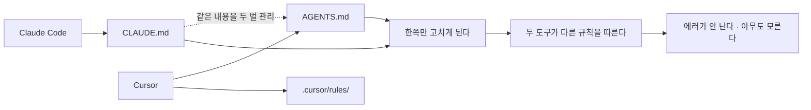
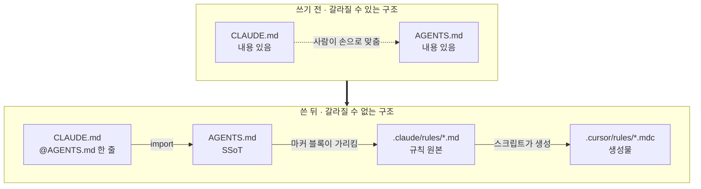
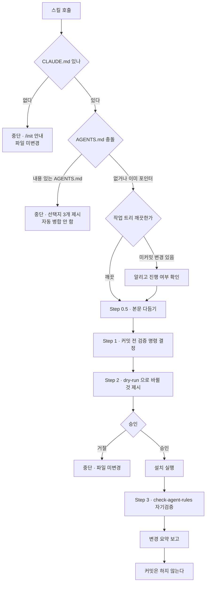
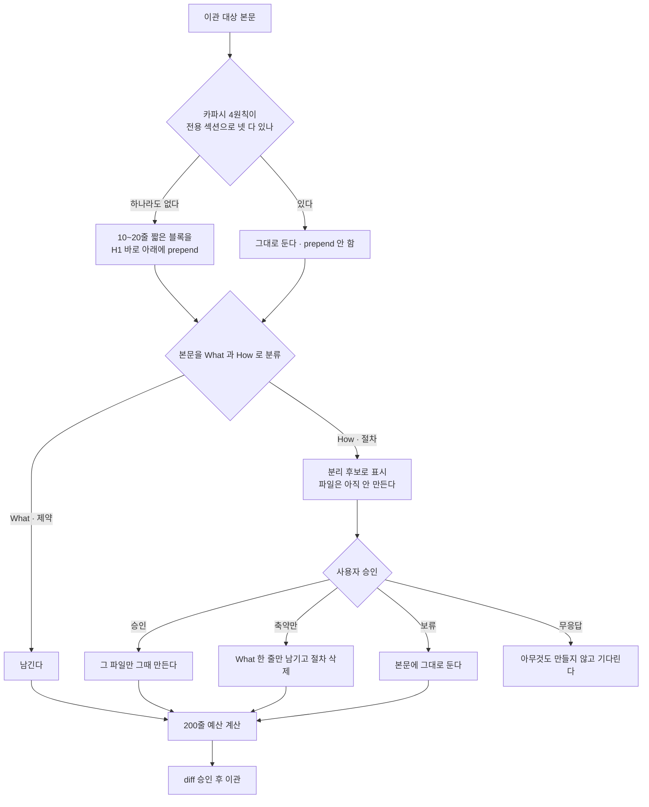
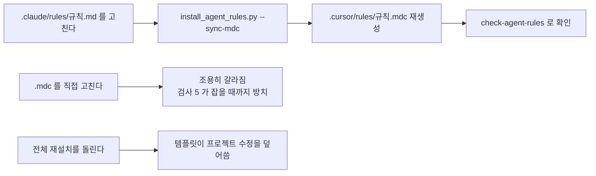
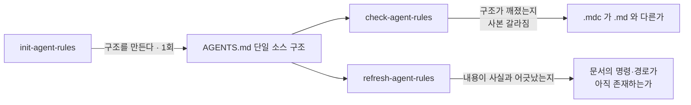

# project-conventions 사용 가이드

> **대상** — Claude Code 와 Cursor 를 함께 쓰는(또는 쓸 예정인) 프로젝트의 개발자
> **범위** — 스킬 3개(`init-agent-rules`, `check-agent-rules`, `refresh-agent-rules`)
> **읽는 순서** — 1~2절이 *왜*, 3~5절이 *쓰면 어떻게 되는지*, 6~8절이 *그 다음*

## 선행 요건과 설치

| 요건 | 왜 필요한가 |
|---|---|
| `python3` | 두 스킬 모두 파이썬 스크립트가 파일을 쓴다 |
| 프로젝트 `CLAUDE.md` | 이관 대상. 없으면 스킬이 중단하고 `/init` 을 안내한다 |
| git 저장소 | 이관 시 `git mv` 로 rename 히스토리를 보존한다. git 이 아니어도 동작은 한다 |

```
/plugin marketplace add https://github.com/kbk109-dev/kbk109-plugins-marketplace
/plugin install project-conventions@kbk109-plugins-marketplace
```

---

## 1. 무슨 문제를 푸는가

Claude Code 와 Cursor 는 **서로 다른 파일**에서 프로젝트 지시를 읽는다.



문제는 갈라진다는 것 자체가 아니라 **갈라져도 아무 일도 일어나지 않는다**는 것이다.
테스트가 깨지지도, 빌드가 실패하지도, 경고가 뜨지도 않는다. Claude 에게는 "`dev` 에서 분기"라고
적혀 있고 Cursor 에게는 "`main` 에서 분기"라고 적혀 있는 상태로 몇 주가 지난다.

> **잘못 갈라진 규칙은 없는 규칙보다 나쁘다.** 규칙이 없으면 사람이 확인하지만, 있으면 믿는다.

같은 함정이 규칙 파일 안에서도 반복된다. `.cursor/rules/*.mdc` 는 `.claude/rules/*.md` 의
사본인데, **사본을 손으로 고쳐도 에러가 나지 않는다.** 그 순간부터 두 도구는 조용히 갈라진다.

---

## 2. 해법 — 흐름을 한 방향으로 고정한다

이 플러그인은 "두 파일을 잘 동기화하자"고 하지 않는다. **동기화할 필요가 없는 구조**로 바꾼다.



세 가지 뼈대다.

1. **`AGENTS.md` 가 단일 소스(SSoT), `CLAUDE.md` 는 포인터.**
   `CLAUDE.md` 에 내용이 없으니 갈라질 여지 자체가 사라진다. Claude 는 `@AGENTS.md`
   import 로, Cursor 는 `AGENTS.md` 를 직접 읽어 같은 글을 본다.
2. **규칙 본문은 `.claude/rules/*.md` 가 원본, `.cursor/rules/*.mdc` 는 생성물.**
   사람이 고치는 곳을 한 곳으로 못 박는다.
3. **생성물이 갈라졌는지는 `check-agent-rules` 가 바이트 단위로 잡는다.**
   조용한 실패를 시끄러운 실패(exit 1)로 바꾸는 것이 이 플러그인의 핵심이다.

---

## 3. 실행하면 무슨 일이 일어나나

`/project-conventions:init-agent-rules` 를 부르면 이 순서로 진행된다.



### 몇 번 멈춰 서서 물어보나

실행 전에 가장 궁금한 지점이다. **최대 4번**이고, 그 전까지 파일은 하나도 바뀌지 않는다.

| # | 멈추는 지점 | 무엇을 묻나 | 안 물어도 되는 경우 |
|---|---|---|---|
| 1 | Step 0-3 | 작업 트리가 더러운데 진행할지 | 트리가 깨끗하면 안 묻는다 |
| 2 | Step 0.5-4 | How 절차를 어디로 분리할지 | 분리 후보가 0건이면 안 묻는다 |
| 3 | Step 0.5-6 | 다듬은 본문 diff 를 승인할지 | 다듬을 게 없으면 안 묻는다 |
| 4 | Step 2 | `--dry-run` 계획대로 설치할지 | **항상 묻는다** |

게이트에서 걸리면 묻는 게 아니라 **중단**한다. `CLAUDE.md` 가 없으면 뼈대를 지어내지 않고,
내용 있는 `AGENTS.md` 가 있으면 자동 병합하지 않는다 — 규칙 문서는 조용한 유실이 치명적이다.

---

## 4. Step 0.5 — 옮기기 전에 다듬는다 (1.4.0~)

`/init` 이 만든 초안은 **이관되는 순간 SSoT 가 된다.** 결함도 같이 굳어 이후 모든 세션의
전제가 된다. 그래서 옮기기 전에 세 가지를 정규화한다.



**What 과 How 를 가르는 리트머스** — *오타 한 줄을 고치는 대화에도 매번 필요한가?*
아니면 그 작업을 할 때만 필요한가. 후자면 How 다. `AGENTS.md` 는 모든 대화의 머리에 붙으므로,
가끔 쓰는 릴리스 절차가 거기 있으면 **모든 대화가 그 토큰을 낸다.**

분리된 절차의 목적지는 두 곳이다. 순서가 있는 절차는 프로젝트 `SKILL.md`(필요할 때만 로드),
특정 경로에만 걸리는 규칙은 `.claude/rules/<name>.md` 의 `paths` frontmatter.

> ### 200줄은 목표이지 상한이 아니다
>
> 자주 오해하는 지점이다. `CLAUDE.md`·`AGENTS.md` 는 **길어도 전부 로드된다.**
> 넘겼다고 뒷부분이 잘리지 않는다. 잘리는 200줄/25KB 상한은 auto-memory 의 `MEMORY.md`
> 전용이다 ([근거](https://code.claude.com/docs/en/memory)).
>
> 그래서 이 스킬은 **truncate 하지 않고, 초과해도 설치를 막지 않는다.** 줄 수를 보고할 뿐이다.
> 200줄은 토큰 예산과 준수율을 위한 목표이고, 초과는 "더 자를 것을 찾아보라"는 신호다.

설치 스크립트가 줄 수를 직접 세어 출력한다. 모델이 손으로 세면 마지막에 붙는 마커 블록이
빠져 어긋나기 때문이다.

```
예상 AGENTS.md 줄 수: 263 (목표 200 미만 — 64줄 초과. 절차를 스킬·규칙 파일로 분리하면 줄어든다)
```

---

## 5. 결과 — 이 저장소의 실제 파일

**이 저장소가 이 플러그인의 첫 사용처다.** 아래는 지어낸 예시가 아니라 지금 여기 있는 파일이다.
직접 열어 대조할 수 있다.

### `CLAUDE.md` — 포인터만 남는다 (전문 8줄)

```markdown
# CLAUDE.md

이 프로젝트의 에이전트 지시는 `AGENTS.md` 에 있다 — Claude 와 Cursor 가 공유하는 단일 소스다.

**이 파일에는 내용을 쓰지 않는다.** 여기에 쓰면 Cursor 가 그것을 못 읽어 두 도구의 지시가
갈라진다. 지시를 추가하려면 `AGENTS.md` 를 고친다.

@AGENTS.md
```

내용이 다시 흘러 들어오면 `check-agent-rules` 검사 3 이 잡는다 — H2 섹션이 하나라도 생기거나
비어 있지 않은 줄이 12줄을 넘으면 실패다.

### `AGENTS.md` 끝의 마커 블록 — 규칙을 가리키기만 한다

```markdown
<!-- >>> agent-rules: git-branch-workflow >>> -->
## Git 브랜치 워크플로

브랜치·커밋·머지 절차는 `.claude/rules/git-branch-workflow.md` 를 따른다.
Cursor 는 `.cursor/rules/git-branch-workflow.mdc` 로 같은 내용을 받는다.

이 블록은 `/project-conventions:init-agent-rules` 가 관리한다. 직접 고치지 말 것 —
재실행하면 덮어쓴다. 규칙 본문을 바꾸려면 `.claude/rules/git-branch-workflow.md` 를 고치고
`/project-conventions:check-agent-rules` 로 사본과의 일치를 확인한다.
<!-- <<< agent-rules: git-branch-workflow <<< -->
```

마커가 **포인터**라는 점이 중요하다. 규칙 본문 91줄이 `AGENTS.md` 안에 들어오지 않는다.
재실행하면 이 구간만 교체되므로 블록이 두 개로 늘어나지 않는다.

### `.cursor/rules/*.mdc` — 프론트매터만 다르고 본문은 바이트 동일

```yaml
---
description: main 직접 작업 금지, dev 에서 분기, 커밋 승인, dev 로만 머지
alwaysApply: true
---
```

`alwaysApply: true` 라서 Cursor 는 이 규칙을 항상 주입한다. 프론트매터 아래 본문은
`.claude/rules/git-branch-workflow.md` 와 **바이트 단위로 같아야** 하고, 그것이 검사 5 다.

### 정직한 예시 하나

이 저장소의 결과가 항상 이상적이지는 않다. 그대로 적는다.

| 관측된 것 | 무엇을 말해 주나 |
|---|---|
| `AGENTS.md` 가 **255줄** — 목표보다 56줄 많다 | 초과해도 설치는 통과한다. 4절의 "목표이지 상한이 아니다"가 문구가 아니라 실제 동작이다 |

이미 설치된 규칙은 재설치해도 **지워지지 않는다.** 규칙 제거는 `.md`·`.mdc`·마커 블록을
직접 지우는 수동 작업이다.

---

## 6. 설치 후 유지보수

규칙을 프로젝트에 맞게 고치는 일이 반드시 생긴다. **고치는 경로가 하나뿐**이라는 게 핵심이다.



- `--sync-mdc` 는 **템플릿이 아니라 현재 `.md`** 를 원본으로 사본을 다시 만든다.
  그래서 프로젝트 고유 수정이 살아남는다. 전체 재설치는 템플릿에서 다시 렌더하므로 덮어쓴다.
- 기존 `.mdc` 프론트매터는 **보존**된다. 플러그인이 `description` 문구를 바꿔도 이미 설치된
  프로젝트에서는 자동으로 갱신되지 않는다 — 필요하면 손으로 맞춘다.

### `check-agent-rules` 가 보는 6가지

```
/project-conventions:check-agent-rules
```

| # | 검사 |
|---|---|
| 1 | `AGENTS.md` 존재·비어 있지 않음 |
| 2 | `CLAUDE.md` 가 `@AGENTS.md` 를 가리킴 |
| 3 | `CLAUDE.md` 에 본문이 다시 유입되지 않음 |
| 4 | `.claude/rules/<규칙>.md` 존재 |
| 5 | `.cursor/rules/<규칙>.mdc` 본문이 4번과 **바이트 동일** |
| 6 | `AGENTS.md` 의 규칙별 마커 블록이 온전함 |

4·5·6 은 규칙마다 반복한다. `.md`·`.mdc`·마커 블록 셋 중 **하나라도** 있으면 그 규칙은
설치된 것으로 보고 나머지 둘도 요구한다 — 반쪽 설치를 잡기 위해서다. 셋 다 없는 선택 규칙은
건너뛴다(안 쓰는 것은 갈라짐이 아니다).

**5번이 이 플러그인의 존재 이유다.** 스크립트는 단독 호출할 수 있고 실패 시 exit 1 이므로
pre-commit 훅에 걸어도 된다.

```bash
python3 ~/.claude/plugins/.../check-agent-rules/scripts/check_agent_rules.py --project-root .
```

### 시간이 지나 내용이 낡았을 때 — `refresh-agent-rules`

위 두 스킬로는 **내용이 틀린 것**을 못 잡는다. `check-agent-rules` 는 `.mdc` 가 `.md` 와 같은지를
볼 뿐, `.md` 에 적힌 `npm test` 가 아직 존재하는 명령인지는 보지 않는다. 세 스킬은 서로 다른
문제를 본다.



```
/project-conventions:refresh-agent-rules
```

프로젝트를 스캔해 명령·패키지 매니저·툴체인·디렉터리 구조 같은 **사실**을 모으고, 마지막 갱신
이후 git 변경분으로 어디부터 볼지 정한 뒤 `AGENTS.md` 의 주장과 대조한다.

**바꿀 게 없으면 파일을 열지도 않는다.** 무엇을 확인했는지만 보고하고 끝낸다 — 갱신 스킬이
매번 뭔가를 고쳐야 한다는 압박으로 멀쩡한 문서를 흔드는 것이 가장 흔한 실패다.

| 특징 | 이유 |
|---|---|
| `AGENTS.md` 본문만 고친다 | 마커 블록은 `init` 이 덮어쓰고, `.mdc` 는 생성물이며, `CLAUDE.md` 는 포인터다 |
| **삭제만 항목별 승인** | 사람이 손으로 쓴 설계 근거를 모델이 "낡았다"고 지우는 것이 최대 손실이다. 긴 diff 안의 삭제 한 줄은 놓치기 쉽다 |
| 삭제 근거에 출처를 붙인다 | 사라진 경로·바뀐 스크립트명 등 **어느 사실에서 나왔는지** 못 대면 판정 대상이 아니다 |
| 200줄 규칙은 `init` 과 동일 | 규칙 정본이 둘이면 반드시 갈라진다. 이 플러그인이 막으려는 실패를 자기 자신에게 하지 않는다 |

마지막 갱신 시점은 `.claude/agent-rules.state.json` 에 남고 **커밋 대상**이다. 팀원이 각자 다른
기준점을 들면 같은 변경을 몇 번이고 다시 제안하게 된다. 기준점이 rebase 로 사라지면 스크립트가
그 사실을 알리고 전체 대조로 되돌아간다 — 빈 diff 를 "변경 없음" 으로 읽으면 놓친 갱신을 영원히
못 잡는다.

---

## 7. 언제 쓰지 말아야 하나 · 자주 막히는 곳

| 상황 | 어떻게 되나 |
|---|---|
| `CLAUDE.md` 가 없다 | 중단하고 `/init` 을 안내한다. **뼈대를 지어내지 않는다** — 추측으로 채운 지시는 이후 모든 세션의 전제가 된다 |
| 내용 있는 `AGENTS.md` 가 이미 있다 | 자동 병합하지 않고 멈춘다. `abort`(기본) / `append-claude`(이어붙이고 사용자가 정리) / `keep-agents`(기존 유지, `CLAUDE.md` 본문 폐기) 중에서 고른다 |
| Cursor 를 안 쓴다 | `.mdc` 미러가 무의미해지지만, 규칙을 `.claude/rules/` 로 분리하는 것과 200줄 정리는 그대로 이득이다. `AGENTS.md` 이관만 빼고 쓰기는 어려우므로, Cursor 도입 계획이 없다면 도입 가치는 절반이다 |
| 기본 브랜치를 잘못 잡는다 | `origin/HEAD` → 로컬 `main`/`master` → 브랜치가 하나뿐이면 그것 → `main` 순으로 탐지한다. 원격이 없고 브랜치가 여럿이면 맞힐 방법이 없다. **`--dry-run` 출력의 `main branch: X` 를 반드시 확인**하고 틀리면 `--main-branch` 로 지정한다. 이 값은 규칙 본문 전체에 박히므로 나중에 고치려면 재설치해야 한다 |
| 종료 코드 3 이 뜬다 | 게이트 실패다. **재시도할 대상이 아니다** — stderr 를 그대로 읽고 어느 게이트인지 확인한다 |
| 커밋이 안 된다 | 의도된 동작이다. 이 스킬은 **어떤 경우에도 커밋하지 않고** 변경 요약만 보고한다 |

한 가지 더. Step 0.5 는 이관 전에 `CLAUDE.md` 를 고치므로 그 시점에 작업 트리가 더러워진다.
그 상태로 설치하면 스크립트가 `git mv` 대신 직접 쓰기로 빠져 **rename 히스토리만 사라진다**
(본문 이관 자체는 정상). 히스토리를 남기고 싶으면 Step 0.5 변경을 먼저 커밋하면 된다.

---

## 8. 더 읽을 곳

| 문서 | 내용 |
|---|---|
| [플러그인 README](../../plugins/project-conventions/README.md) | 설치되는 것의 목록 |
| [`init-agent-rules/SKILL.md`](../../plugins/project-conventions/skills/init-agent-rules/SKILL.md) | 에이전트가 실제로 따르는 실행 지시 |
| [`references/claude_md_rewrite.md`](../../plugins/project-conventions/skills/init-agent-rules/references/claude_md_rewrite.md) | Step 0.5 재작성 규칙 정본 |
| [`references/conflict_policy.md`](../../plugins/project-conventions/skills/init-agent-rules/references/conflict_policy.md) | `AGENTS.md` 충돌 처리 절차 |
| [`check-agent-rules/SKILL.md`](../../plugins/project-conventions/skills/check-agent-rules/SKILL.md) | 검사 스킬 |
| [`refresh-agent-rules/SKILL.md`](../../plugins/project-conventions/skills/refresh-agent-rules/SKILL.md) | 갱신 스킬 |
| [`references/refresh_policy.md`](../../plugins/project-conventions/skills/refresh-agent-rules/references/refresh_policy.md) | 갱신 판정 규칙 정본 |
| [`docs/harness-engineering/`](../harness-engineering/) | 이 저장소 스킬들이 따르는 설계 원칙 |
